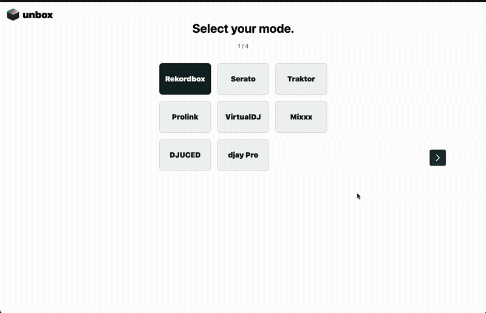
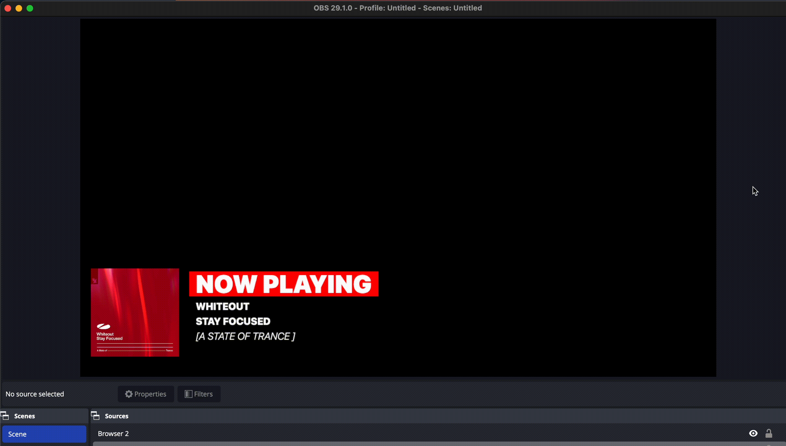
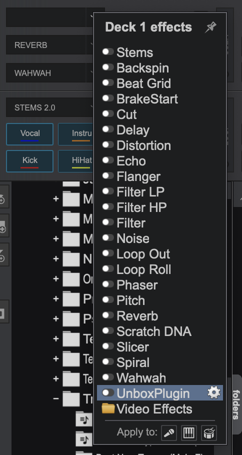

# **unbox**

### Display your Rekordbox, Serato, Traktor, VirtualDJ, Mixxx, DJUCED, and djay Pro tracks to your viewers on Twitch

  
  

## **Our Supporters**

  
  
  
  
  

## **Setup**

Unbox is designed to be simple to use while providing the most accurate track metadata software. Download the app, unzip, launch, pick your mode, and copy the URLs into OBS. If you encounter any issues, please create an issue here, and we'll respond ASAP.

1. **Download and install the Unbox desktop app**. Here's the [Mac version](https://github.com/erikrichardlarson/unbox/releases/download/11.3/unbox-mac.zip) and the [Windows version](https://github.com/erikrichardlarson/unbox/releases/download/11.3/unbox-win.zip).

2. **Launch the app and select Your DJ Mode**. Simply select the mode that corresponds to your DJ software.

3. **For VirtualDJ or Traktor users, we have plugins that allow Unbox to follow the master channel**.

- For Traktor, download this [D2 file](https://github.com/erikrichardlarson/unbox/releases/download/11/D2.zip), extract it, and place it in your CSI folder located at `C:\Program Files\Native Instruments\Traktor Pro 3\Resources64\qml\CSI` on Windows or `/Applications/Native Instruments/Traktor Pro 3/Traktor.app/Contents/Resources/qml/CSI` on Mac. Then, open Traktor and select D2 as your controller: `Traktor > Settings > Controller Manager > Select D2 from dropdown`.

- For VirtualDJ, download our [Windows plugin](https://github.com/erikrichardlarson/unbox/releases/download/11/UnboxPlugin.zip) or [Mac plugin](https://github.com/erikrichardlarson/unbox/releases/download/11/UnboxPlugin.bundle.zip), extract it, and place it in your `SoundEffect Plugins` folder. This is located at `C:\Users\YOUR_USERNAME\Documents\VirtualDJ\Plugins64\SoundEffect` on Windows or `/Users/<USER>/Library/Application Support/VirtualDJ/PluginsMacArm` on Mac. This plugin will be available in the `Sound Effects` dropdown in VirtualDJ as "WindowsUnboxPlugin" or "MacUnboxPlugin". Select the plugin in the dropdown:

  

## **Usage**

- **Available Overlays**: Unbox offers two overlays: a track overlay at `http://localhost:8001/unbox_overlay.html` and an album overlay at `http://localhost:8001/album_art.html`. The track overlay displays the Artist, Title, Remixer, and Label. The album art overlay shows the album art, if available, or if found through Unbox Plus.

- **Unbox Plus**: Unbox Plus supplements your existing track metadata with corrected metadata or missing metadata via our metadata API. It also provides up to 500 recommended tracks based on your tracklist history.

## **Contact Information**

If you encounter any issues, you can post them here, or you can reach me at erikrichardlarson@gmail.com.
